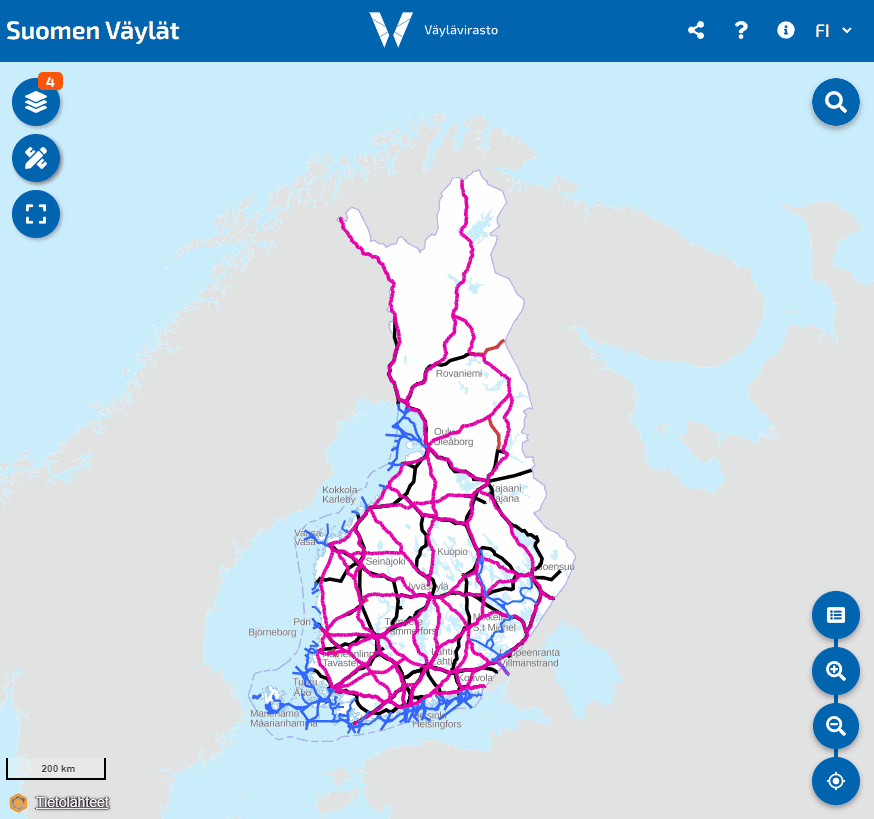

# Suomen Väylät

You can test this app at the following url: https://paikkatietotest.testivaylapilvi.fi/suomen-vaylat/



The Suomen Väylät map service brings together the Finnish Transport Infrastructure Agency open materials related to different fairway formats. Through the service, we want to describe information as smoothly, visibly, up-to-date and in a variety of ways as possible for different user groups and needs.

## Release Notes

You can read the release notes from another [ReleaseNotes.md](ReleaseNotes.md) file.

## Development

### Preparations
- [ ] Install Node.js
- [ ] Create Oskari.org published map (this published map need contains also new created RPC functions)
- [ ] Create Environment variable files under suomen-vaylat-app folder and copy following into it (change `<PUBLISHED_OSKARI_MAP_DOMAIN>` and `<PROXY_DOMAIN>` to correct ones):
    ```
    REACT_APP_PUBLISHED_MAP_URL=https://<PUBLISHED_OSKARI_MAP_DOMAIN>?uuid=aaaaaaaa-bbbb-cccc-dddd-eeeeeeeeeeee
    REACT_APP_PUBLISHED_MAP_DOMAIN=<PUBLISHED_OSKARI_MAP_DOMAIN>
    REACT_APP_PROXY_URL=https://<PROXY_DOMAIN>
    REACT_APP_WEBSOCKET_URL=wss://<WEBSOCKET URL>

    REACT_APP_SITE_URL=http://localhost:3000
    REACT_APP_ROUTER_PREFIX=/
    ```

    Description for keys and values:

    | Key                            | Value                                                                                                                                                                                        |
    |--------------------------------|----------------------------------------------------------------------------------------------------------------------------------------------------------------------------------------------|
    | REACT_APP_PUBLISHED_MAP_URL    | Published Oskari map url, example: `https://<PUBLISHED_OSKARI_MAP_DOMAIN>?uuid=aaaaaaaa-bbbb-cccc-dddd-eeeeeeeeeeee` (this published map need contains also new created RPC functions)       |
    | REACT_APP_PUBLISHED_MAP_DOMAIN | Published map domain, example: `<PUBLISHED_OSKARI_MAP_DOMAIN>`                                                                                                                               |
    | REACT_APP_PROXY_URL            | Proxy url, example: `https://<PROXY_DOMAIN>`                                                                                                                                                 |
    | REACT_APP_WEBSOCKET_URL        | Backend server websocket url for support downloads, example: `wss://<WEBSOCKET URL>`                                                                                                         |
    | REACT_APP_SITE_URL             | App site url, example: `http://localhost:3000`                                                                                                                                               |
    | REACT_APP_ROUTER_PREFIX        | React router prefix, example: `/` or `/suomen-vaylat/`  (if application is not in domain root folder, then define subfolder here)                                                            |


    Environment variable files

  * Localhost development (npm start) create file `.env.development.local` under suomen-vaylat-app folder
  * Production build (npm create build) create file `.env.production.local` under suomen-vaylat-app folder

### !Error Module not found: Error: Can't resolve '@mui/material/styles' in
After building application from scratch ( delete node_modules and package-lock.json ) start may fail
to error mentioned on header. It is caused by mui bug which causes components to render unsynced. 
It can be fixed by running command:
`npm install @mui/material @emotion/react @emotion/styled`


### Run in development

In the `suomen-vaylat-app` directory, you can run:

- `npm start` runs the app in the development mode.\
  Open [http://localhost:3000](http://localhost:3000) to view it in the browser.\
  The page will reload if you make edits. You will also see any lint errors in the console.
- `npm test` launches the test runner in the interactive watch mode.

### Create production build

In the `suomen-vaylat-app` directory, run `npm build`.

Command builds the app for production to the `build` folder.\
It correctly bundles React in production mode and optimizes the build for the best performance.

The build is minified and the filenames include the hashes.\
Your app is ready to be deployed!

### Generate translations excel

Run `npx i18n-json-to-xlsx-converter --convert 'src/translations/fi.json,src/translations/en.json,src/translations/sv.json'` command (in `suomen-vaylat-app` folder) to generate separated Excel files for three languages.
If you want you can copy all translations to same one excel now, do following:
- rename fi.xlsx to translations.xlsx
- open en.xlsx and copy second column to translations.xlsx third column
- open sv.xlsx and copyt second column to translations.xlsx fourth column
- save excel and send transtalitions.xls now some who translate texts

### Generate translation json's from excel

- Copy translations.xlsx to `suomen-vaylat-app/src/translations` folder
- Run `npx i18n-json-to-xlsx-converter --convert 'src/translations/translations.xlsx'` command (in `suomen-vaylat-app` folder) to generate separated translations json files

## Reporting issues

Issues should be reported here: https://github.com/finnishtransportagency/suomen-vaylat/issues

## License

This work is lisenced under [EUPL v1.1](https://joinup.ec.europa.eu/software/page/eupl/licence-eupl)
(any language version applies, English version is included in https://github.com/finnishtransportagency/suomen-vaylat/blob/master/LICENSE.EUPL-11.pdf).